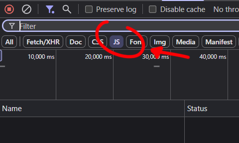

# PICO8 EXTRACTOR

PICO8 Extractor is a user-friendly tool designed to convert PICO-8 JavaScript cart exports into binary .p8.rom files that can be directly loaded in the PICO-8 fantasy console.

# HOW TO USE IT

📘 How to Use

Follow these steps to extract a .p8.rom file from a browser-playable PICO-8 game (hosted as a .js file):

1. Open the game in your web browser

Navigate to the webpage where the PICO-8 game is being played (e.g., itch.io, Lexaloffle, etc.).

2. Open Developer Tools (Inspector)

Right-click anywhere on the page and choose Inspect
or

Press F12 or Ctrl+Shift+I (on Windows)

3. Go to the Network tab

In the Developer Tools panel, click the Network tab.

In the filter bar, click on JS to only show JavaScript files.

📌 Tip: If the page is already loaded, refresh it with the Network tab open.

4. Start the game

Click the “Play” button or otherwise start the game so that the necessary files load.

Look for a .js file in the Network list that looks like the game payload (e.g. game-v1.0.js, etc.).

5. Save the JS file

Right-click the identified .js file and select "Open in new tab".

In the new tab, right-click and choose "Save As..." to download the file to your computer.

📂 Save it somewhere you can find easily — you'll need to point to this folder in the next step.

6. Run PICO8 Extractor

Open the PICO8 Extractor app.

Click "Select Input Folder" and choose the folder where the .js file(s) are saved.

Click "Select Output Folder" where you want the .p8.rom files to be saved.

Click "Start" to begin extraction.

🕹️ The app will process each .js file, extract the embedded ROM, and save it as a .p8.rom file in the output folder.

✅ Done!

You can now load the extracted ROM into PICO-8 by simply dragging and dropping the .p8.rom file into the PICO-8 window.

## Important usage notes

This tool is provided to help recover and run certain game files that may sometimes be inaccessible, so people can play them on the web for educational or archival purposes.

Please note:
- Use is limited to **non-commercial** purposes. You may experiment, learn, and adapt the code, but you may **not** sell or otherwise monetize it.
- **Do not** use this tool to crack software, distribute pirated games, or enable unauthorized access. Those activities are prohibited.
- If you publish or share modified versions, a brief credit to the original author is appreciated.
- No warranty — the author is not liable for misuse.

Full license text: [LICENSE.txt](./LICENSE.txt)
